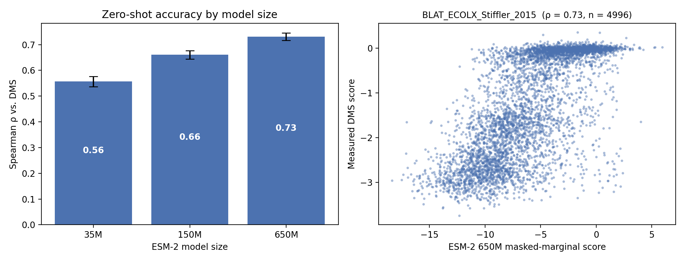
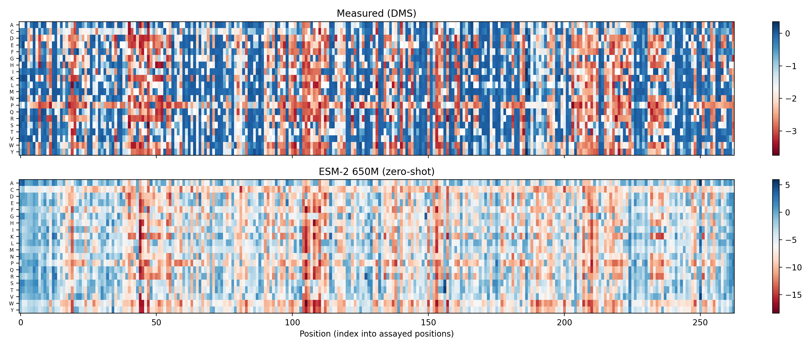
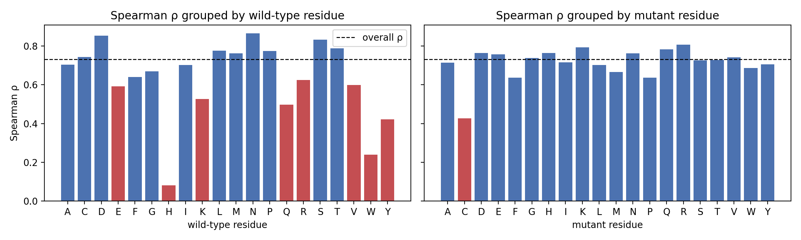
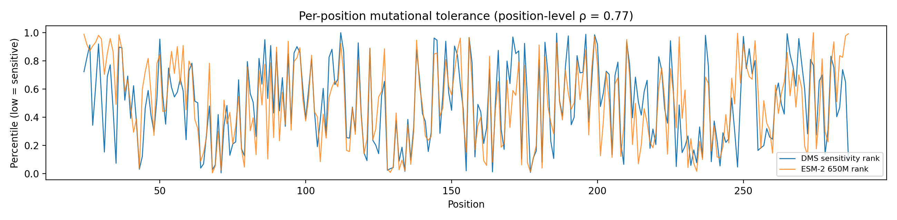

# Zero-shot variant effect prediction with ESM-2

[](https://colab.research.google.com/github/tanvigambhir/esm-variant-effects/blob/main/esm2_zero_shot_dms.ipynb)

**Question.** A protein language model trained only on natural sequences has learned which amino acids "fit" at each position. Can it predict, with no lab data and no training, how single substitutions change a protein's function? Does a bigger model predict better?

## Approach

| Step | Details |
|---|---|
| Data | [ProteinGym](https://proteingym.org) DMS assay `BLAT_ECOLX_Stiffler_2015`: TEM-1 β-lactamase (286 aa), ampicillin-resistance fitness for ~5,000 single mutants |
| Models | ESM-2 at 35M, 150M and 650M parameters (Hugging Face) |
| Score | Masked marginal: mask position *i*, then `log p(mutant) − log p(wild type)`. One pass per position yields the full L × 20 saturation map |
| Metric | Spearman ρ against measured fitness (ProteinGym standard), with 1,000-sample bootstrap 95% CIs |
| Error analysis | Accuracy by wild-type and mutant residue, position-level vs. within-position accuracy, positions and mutations with the largest rank disagreement |

## Results

With no training and no lab data, ESM-2 650M ranks 4,996 single mutants across 263 positions with **Spearman ρ = 0.73** against measured fitness.

| ESM-2 size | Spearman ρ | 95% CI |
|---|---|---|
| 35M | 0.56 | 0.54–0.58 |
| 150M | 0.66 | 0.64–0.68 |
| 650M | **0.73** | 0.72–0.75 |

**Bigger model is better here.** Accuracy rises at every step (+0.17 ρ from 35M to 650M), and the bootstrap confidence intervals do not overlap. Scaling gains are not guaranteed across proteins (ProteinGym reports them flattening or reversing on some assays), so this is a result for TEM-1, not a general law.



The scatter shows two regimes. Mutations the model scores very negatively are reliably damaging. Near zero, the measured scores pile up at the assay's neutral ceiling: 42% of mutants have DMS score > −0.5, and within that group ρ drops to 0.38. Part of the error is the model, and part is that the assay cannot separate mild effects well.



## Where the model fails

**It knows where better than what.** Ranking positions by average sensitivity gives ρ = 0.77, but ranking substitutions within a single position gives a median ρ of only 0.62. The model reliably finds the intolerant sites, but is less sure which replacement is worst at a given site.

**It underestimates the protein's ends.** Of the 8 positions the model rates most tolerant relative to the assay, 7 lie at the termini of the mature protein: positions 27–44 near the N-terminus and 248–286 near the C-terminus, including the final residue, W286. Termini vary a lot across evolution, so a model trained on natural sequences learns to treat them as permissive. In TEM-1 these regions are structured and essential for resistance.

**It overestimates some charged residues.** Five of the 8 positions the model rates most sensitive relative to the assay are charged (R41, E87, R176, K190, R271). The model treats them as conserved, while the assay finds them fairly tolerant.

**Accuracy is uneven by residue type.** Mutations *from* histidine (ρ = 0.08) and tryptophan (ρ = 0.24) are poorly predicted, though these come from only 6 and 4 positions respectively, so they are noisy estimates. Among mutations *to* a residue, mutations to cysteine are the weakest (ρ = 0.43).



*Positions are indices into the full precursor sequence used by ProteinGym (signal peptide = 1–23). Add 2 to convert to standard Ambler numbering for positions up to 236; e.g. position 68 = catalytic Ser70.*



## Reproduce

Open the notebook in Colab, set **Runtime → T4 GPU**, and run all cells. To try another protein, change `DMS_ID` to any ID in ProteinGym's `DMS_substitutions.csv`.

```
esm2_zero_shot_dms.ipynb   # full pipeline
results/summary.json       # headline numbers
results/*_scores.csv       # per-mutant scores from every model
figures/                   # all plots
```

## Next steps

- Add a supervised baseline (ridge regression on ESM-2 embeddings, cross-validated by position) to measure how much a few labels add over zero-shot.
- Annotate positions with relative solvent accessibility from the AlphaFold structure to test the buried vs. surface hypothesis directly.
- Extend across many ProteinGym assays to see whether the size trend holds generally.

## References

- Lin et al. (2023). Evolutionary-scale prediction of atomic-level protein structure with a language model. *Science*. (ESM-2)
- Meier et al. (2021). Language models enable zero-shot prediction of the effects of mutations on protein function. *NeurIPS*. (masked-marginal scoring)
- Notin et al. (2023). ProteinGym: Large-scale benchmarks for protein fitness prediction and design. *NeurIPS*.
- Stiffler et al. (2015). Evolvability as a function of purifying selection in TEM-1 β-lactamase. *Cell*.
